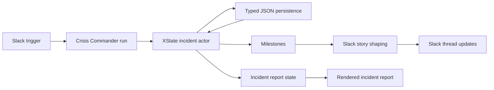
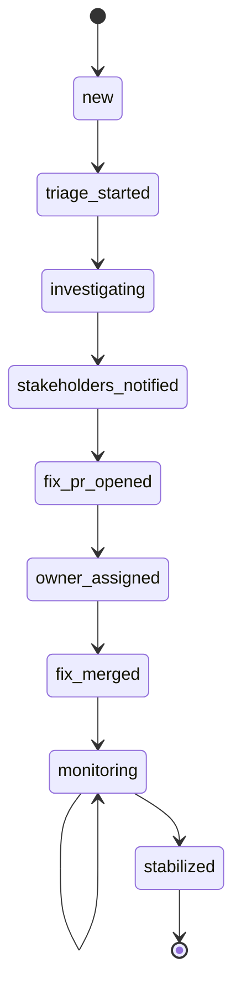

# Crisis Commander Agent

**🚨 Detect incidents. 🧠 Run RCA. 🛠️ Coordinate the fix. ✅ Close only after production is stable.**

The Crisis Commander Agent is built to respond to software incidents like an operational teammate: it detects repeated failures, starts RCA automatically, correlates monitoring and repository evidence, updates the incident report, pages stakeholders, invokes Codex to start the fix path, waits for human merge confirmation, and monitors production until the incident is genuinely stable.

`codex-crisis-room` is the hackathon environment built to showcase that agent in action. The current build runs the commander against a simulated production environment, but the command loop itself is real and designed to plug into real repositories, real monitoring systems, and real incident workflows.

## ✨ What This Is

Codex Crisis Room is an incident simulation environment for demonstrating agentic incident response.

The project is centered on one idea: **an AI incident commander should be able to do operational work, not just answer questions**.

In the live demo, the commander:
- detects repeated billing failures in Slack
- opens automated RCA without waiting for a human prompt
- correlates incident evidence across simulated Sentry and GitHub signals
- identifies suspect PRs and relevant files
- updates the incident report as the investigation evolves
- pages stakeholders
- invokes Codex to prepare a fix path
- pauses for human confirmation before merge
- monitors the rollout and closes the incident only after clean health checks

```mermaid
flowchart LR
    A[🚨 Alert burst in Slack] --> B[🧠 Crisis Commander detects repeated incident]
    B --> C[📡 Correlate monitoring evidence]
    C --> D[🗂️ Inspect repo changes and suspect PRs]
    D --> E[🧵 Update incident report and page stakeholders]
    E --> F[🛠️ Invoke Codex to start the fix]
    F --> G[👩‍💻 Human review gate]
    G --> H[🚀 Rollout and monitor]
    H --> I[✅ Stabilize and close incident]
```



## 🤖 The Crisis Commander Agent

The Crisis Commander Agent is the core of the project.

It is built to handle the workflow a real on-call incident lead would normally coordinate across multiple systems and people:

### Detection
- recognizes repeated failure patterns from incoming alert traffic
- groups noisy signals into a single incident
- starts triage automatically

### Investigation
- queries monitoring evidence for recurring signatures
- inspects recent repository changes related to the affected system
- narrows the likely regression path using suspect PRs and touched files
- maintains structured incident state as it learns more

### Coordination
- writes incident report updates as new evidence arrives
- notifies stakeholders in the incident thread
- hands work to a human reviewer at the right moment
- tracks incident ownership explicitly

### Resolution
- invokes Codex to start the fix path
- opens a candidate fix PR in the simulated environment
- waits for human confirmation before merge
- resumes rollout once review is confirmed

### Post-Incident Monitoring
- checks recovery signals after rollout
- distinguishes residual failures from true ongoing impact
- closes the incident only after a clean monitoring window

This hackathon version demonstrates the commander on one seeded billing-failure incident, but the design is intended for real repository and incident workflows.

## 💾 Durable Incident State

The commander does not operate as a one-shot chat response. It runs on durable incident state that survives the flow of the demo and can be rendered into Slack updates, reports, and monitoring progression.



## 🌐 Why Crisis Room Exists

The demo environment is simulated because live incidents are a bad dependency for a hackathon demo.

What is real:
- the commander loop
- tool orchestration
- incident state transitions
- Slack-triggered incident flow
- milestone generation
- human review gate
- monitoring and stabilization logic
- report rendering

What is simulated:
- Sentry evidence payloads
- GitHub investigation payloads
- fix PR side effects
- production health checks
- final incident report destination

That tradeoff keeps the demo deterministic while preserving the real product core. The simulation layer can be replaced with live integrations without changing the overall agent architecture.

## 🎬 Demo Flow

The current demo is a Slack-first incident narrative.

1. A billing monitor posts 3 consecutive renewal failures into `#incidents`.
2. Crisis Bot detects the repetition and initiates automated RCA.
3. The commander correlates a repeated Sentry signature with recent billing changes.
4. It posts the likely regression path, suspect PRs, and relevant files.
5. It updates the incident report and pages stakeholders.
6. It invokes Codex to start the fix and opens a candidate fix PR.
7. It pauses for a real human reviewer to confirm the fix.
8. After confirmation, it resumes the flow, rolls out the fix, monitors recovery, and closes the incident.

The result is a believable incident-room thread backed by real agent state, not a canned transcript replay.

## 🧪 What Makes This More Than a Scripted Demo

Codex Crisis Room is not just printing prewritten Slack messages.

The implementation contains:
- a real tool-loop commander
- typed incident state and transitions
- persisted incident records
- scenario-backed investigation tools
- milestone derivation from actual execution
- Slack transport and thread handling
- a real human confirmation gate before merge
- monitoring progression that changes incident outcome over time

That means the Slack story is a presentation layer over actual incident progression logic.

## 🏗️ Architecture

### 1. Incident Commander Agent

The commander is the decision-making core. It runs the incident workflow through tool calls instead of hardcoded script steps.

Responsibilities:
- decide which action to take next
- gather evidence
- update the incident report
- coordinate humans
- progress the incident toward resolution
- stop only when the incident is stabilized or gated for human input

### 2. Tool Loop

The agent is implemented with the Vercel AI SDK tool loop and an OpenAI model. The model reasons over the current incident context and chooses from a bounded set of incident tools.

Current tool classes include:
- repeated-incident detection
- triage start
- Sentry-style signal inspection
- GitHub-style change inspection
- incident report update
- stakeholder notification
- candidate fix PR creation
- owner assignment
- merge progression
- production health checks

### 3. Incident State Layer

The incident lifecycle is modeled explicitly instead of being inferred from chat output.

This layer uses:
- `XState` for the incident state machine
- typed transitions for investigation, coordination, merge, monitoring, and closeout
- typed JSON persistence so incidents survive server restarts



### 4. Scenario Engine

The scenario engine powers the simulated production environment.

It provides stateful, evolving responses so the agent sees a world that changes as the incident progresses:
- failures spike before the fix
- suspect evidence points toward a real regression path
- monitoring stays noisy immediately after deploy
- the incident stabilizes only after clean checks

### 5. Slack Transport

Slack is the main demo surface.

The Slack layer handles:
- Socket Mode event intake
- trigger detection from repeated incident messages
- thread mapping to incident IDs
- story-shaped bot replies
- reviewer confirmation before merge
- incident closeout updates

### 6. Reporting Layer

The reporting layer turns structured incident state into a readable incident summary and final rendered report output.

## ⚙️ Tech Stack

- **Bun**: runtime, package manager, and test runner
- **Hono**: lightweight server and route layer
- **TypeScript**: typed application surface
- **Vercel AI SDK**: tool-loop orchestration for the commander
- **OpenAI models**: reasoning and tool selection
- **Slack Socket Mode + Web API**: live Slack demo transport
- **XState**: reliable incident lifecycle state machine
- **Zod**: typed runtime validation
- **JSON persistence**: restart-safe incident storage for the demo

## 📋 Current Capabilities

- Real Slack-triggered incident start
- Automatic repeated-incident detection from a message burst
- Simulated Sentry and GitHub investigation tools with stateful outputs
- Structured incident timeline and report state
- Candidate fix generation step with explicit Codex involvement
- Human review gate before merge
- Post-merge monitoring and stabilization flow
- Rendered transcript/report surfaces for demo playback and debugging

## 🚀 Running The Project

### Prerequisites

- Bun
- an OpenAI API key
- a Slack app configured for Socket Mode

### Install

```sh
bun install
```

### Start

```sh
bun run start
```

### Environment

The project expects a `.env` file with values for:
- OpenAI access
- Slack bot/app tokens
- Slack incidents channel ID
- optional demo-specific values for reviewer mentions, stakeholder mentions, repo links, and report links

See `.env.example` for the full set of variables.

## 🗂️ Repository Structure

```text
src/
  agent/        Incident Commander Agent, tools, traces, milestones
  incidents/    State machine, persistence, scenario engine, services
  slack/        Socket Mode transport, rendering, trigger detection
  demo/         Transcript and Slack story shaping
  reporting/    Incident report state and rendering
  routes/       Health, debug, incident, and agent endpoints
```

## 🎯 Current Scope

This repository currently focuses on one seeded billing-renewal incident scenario.

That is intentional. The goal of the hackathon build is to prove that the Incident Commander Agent can handle the full lifecycle of one believable incident extremely well.

## 🔭 Future Direction

The next step is not “make the demo flashier.” It is to replace simulated surfaces with real ones:
- real Sentry integration
- real GitHub investigation and PR links
- real incident report destination
- multiple incident classes
- richer production and rollout signals
- broader repository-aware incident reasoning

## Why This Matters

Software incidents are one of the clearest places where agentic systems can provide leverage:
- the work is multi-step
- the context is distributed across systems
- the timing matters
- humans still need to stay in control

Codex Crisis Room shows what it looks like when Codex becomes an operational teammate instead of a chatbot.
